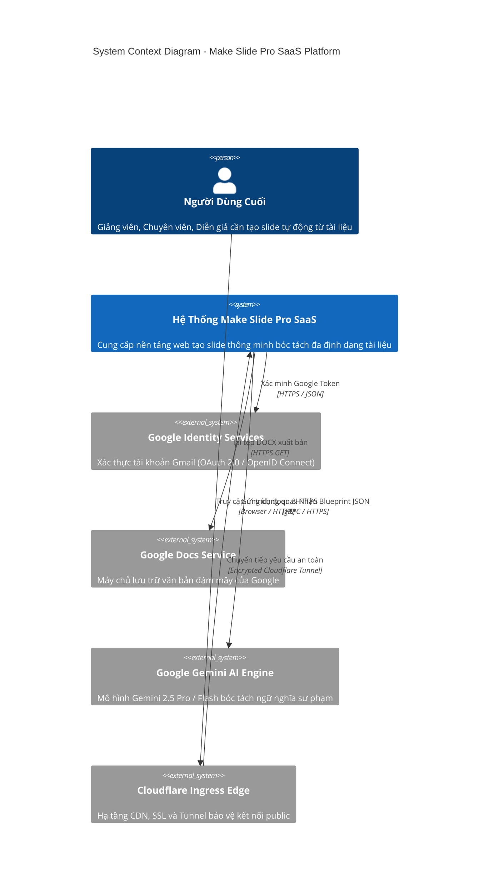
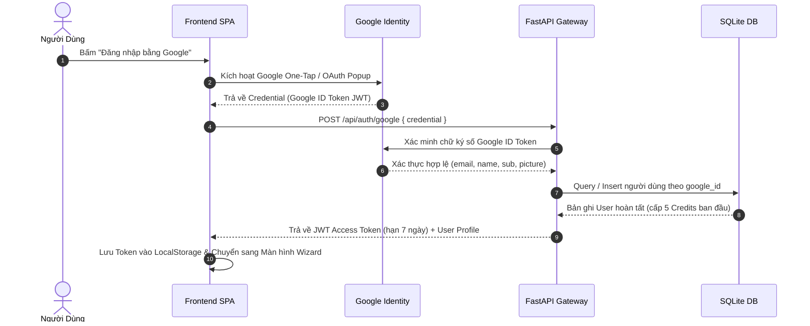
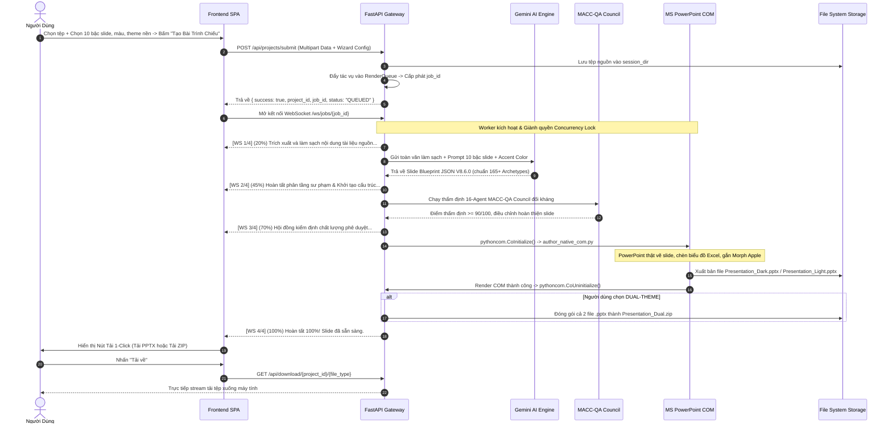

# BẢN THIẾT KẾ HỆ THỐNG TOÀN DIỆN & CHUẨN MỰC
## MAKE SLIDE PRO SAAS V8.6.0 (ENTERPRISE EDITION)
**Mã tài liệu: MSP-SDD-V86 | Tiêu chuẩn: IEEE 1016-2009 / C4 Model | Trạng thái: PHÊ DUYỆT THỰC THI**
*Ngày ban hành: 2026-09-21 | Bản quyền: Make Slide Pro Platform*

---

## 1. BỐI CẢNH DỰ ÁN & MỤC TIÊU KỸ THUẬT

### 1.1. Bối cảnh
Lõi công nghệ **Make Slide Pro V8.6.0** (nằm tại thư mục `D:\Make Slide PPT`) hiện là công cụ tự động hóa xuất bản PowerPoint có năng lực cao nhất với 165+ Mega Archetypes, hội đồng thẩm định MACC-QA 16-Agent và động cơ dựng hình native PowerPoint COM Automation kết hợp biểu đồ Excel tương phản cao và hiệu ứng Apple Keynote Morph.

Tuy nhiên, hệ thống hiện đang chạy dưới dạng dòng lệnh nội bộ (CLI) hoặc giao diện web studio phức tạp nhiều thao tác. Yêu cầu đặt ra là xây dựng một hệ thống Web Application tinh giản tuyệt đối (Minimalist Frictionless Web SaaS), sẵn sàng công khai ra Internet (Public) cho người dùng cuối truy cập và vận hành tự động.

### 1.2. Mục tiêu kỹ thuật cốt lõi
1. **Đăng nhập một chạm**: Xác thực Gmail qua Google OAuth 2.0, không biểu mẫu đăng ký phức tạp.
2. **Tiếp nhận đa nguồn linh hoạt**: Tiếp nhận nhiều tệp Word (`.docx`), PDF (`.pdf`), PowerPoint (`.pptx`) hoặc đường dẫn chia sẻ Google Docs.
3. **Cấu hình 5 thông số trực quan (Wizard)**:
   - Chủ đề lĩnh vực (7 nhóm chuẩn).
   - Số lượng slide (10 bậc định lượng từ 3 đến hơn 50 slide).
   - Bảng màu chủ đạo (5 preset thương hiệu + mã HEX tự do).
   - Kiểu nền xuất bản (Nền Tối Obsidian, Nền Sáng Pearl, hoặc Xuất cả hai bản đóng gói ZIP).
   - Ghi chú yêu cầu bổ sung (Special Prompt).
4. **Quy đổi chuẩn hóa API Antigravity**:
   - Bản chất của Antigravity là IDE lập trình máy trạm, dùng mô hình Google Gemini (2.5 Pro / 2.0 Flash) làm bộ não suy luận.
   - Khi đưa lên Web Server tự động, máy chủ kết nối trực tiếp đến Google Gemini API bằng SDK chính thức (`google-genai`), kế thừa toàn bộ năng lực bóc tách sư phạm và chọn 165+ Archetypes nhưng hoạt động headless 24/7 không cần người thao tác desktop.
5. **Cách ly an toàn tiến trình PowerPoint COM**: Khóa tuần tự hóa hàng đợi (`asyncio.Lock`) bảo vệ tiến trình đơn luồng STA của Windows Office, kết hợp tiến trình giám sát Watchdog chống nghẽn bộ nhớ.
6. **Công khai Internet an toàn**: Triển khai qua Cloudflare Tunnel (`cloudflared`), miễn phí, ẩn IP máy chủ, mã hóa HTTPS tự động.

---

## 2. MA TRẬN YÊU CẦU CHỨC NĂNG & PHI CHỨC NĂNG

### 2.1. Yêu cầu chức năng (Functional Requirements - FR)
- **FR-01: Google OAuth 2.0 Authentication**: Tiếp nhận Google ID Token từ client, giải mã và xác minh chữ ký số với Google API, tự động khởi tạo bản ghi `User` và cấp phát JWT Bearer Token (thời hạn 7 ngày).
- **FR-02: Multi-File Ingestion**: Cho phép người dùng tải lên đồng thời từ 1 đến 5 tệp (`.docx`, `.pdf`, `.pptx`). Hệ thống tự động gộp văn bản, bóc tách cấu trúc và làm sạch qua `scripts/ingest_content.py`.
- **FR-03: Google Docs Resolver**: Nhận dạng chuỗi URL `docs.google.com/document/d/{ID}`, tự động trích xuất `{ID}` và tải tệp `.docx` tương ứng qua đường dẫn xuất bản chuẩn của Google Docs.
- **FR-04: Topic Domain Classifier**: Dropdown phân loại 7 nhóm lĩnh vực chuẩn (`KINH_TE`, `Y_TE`, `GIAO_DUC`, `CONG_NGHE`, `QUAN_TRI`, `MARKETING`, `TONG_HOP`), truyền vào AI Brain để điều hướng ngữ cảnh học thuật và thuật ngữ chuyên ngành.
- **FR-05: 10-Tier Slide Scale**: Lựa chọn số lượng slide bám sát 10 cấp bậc (từ 3 slide ngắn đến hơn 50 slide toàn thư). AI tự động tính toán tỷ trọng phân bổ nội dung và độ sâu sư phạm tương ứng.
- **FR-06: Brand Accent Coloring**: Cung cấp 5 preset màu sắc cao cấp (Ocean Blue, Emerald Green, Royal Violet, Crimson Red, Amber Gold) và Color Picker tự do. Đồng bộ mã màu vào bảng màu theme, card, KPI và biểu đồ.
- **FR-07: Canvas Background Theme**: Tùy chọn 3 chế độ nền: `DARK` (Nền Tối Obsidian), `LIGHT` (Nền Sáng Pearl), hoặc `DUAL` (Xuất cả hai bản đóng gói trong 1 tệp `.zip`).
- **FR-08: Task Queue & Job State**: Đẩy tác vụ vào hàng đợi `RenderQueue`, trả về mã định danh `job_id` tức thời cho client.
- **FR-09: WebSocket Real-Time Telemetry**: Thiết lập kênh WebSocket `/ws/jobs/{job_id}` phát sóng trạng thái qua 4 bước: [1/4] Ingestion -> [2/4] AI Synthesis -> [3/4] MACC-QA Review -> [4/4] PowerPoint COM Authoring -> [Hoàn tất 100%].
- **FR-10: 1-Click Secure Delivery**: Cung cấp đường dẫn tải file trực tiếp `.pptx` hoặc `.zip` với định danh phiên được bảo vệ, xác thực chủ quyền tài khoản.

### 2.2. Yêu cầu phi chức năng (Non-Functional Requirements - NFR)
- **NFR-01: Độ ổn định hệ thống (Availability & Reliability)**: Cơ chế Watchdog giám sát tiến trình PowerPoint COM; tự động hủy tiến trình (`taskkill`) và thu hồi tài nguyên nếu quá thời gian xử lý (Timeout 120s), không làm ảnh hưởng máy chủ.
- **NFR-02: Hiệu năng xử lý (Performance)**: Phản hồi API tạo tác vụ < 500ms; thời gian render một bộ slide tiêu chuẩn (15-20 slide) hoàn tất trong 30-50 giây.
- **NFR-03: An ninh & Bảo mật (Security & Isolation)**:
  * Kiểm soát định danh Tenant Isolation (ngăn chặn IDOR): Người dùng chỉ truy cập được dữ liệu thuộc quyền sở hữu của chính họ.
  * Giới hạn kích thước tệp tải lên tối đa 50MB/lần.
  * Ẩn toàn bộ địa chỉ IP thật của máy chủ qua Cloudflare Tunnel.
- **NFR-04: Khả năng bảo trì & Mở rộng (Maintainability & Scalability)**:
  * Tầng lưu trữ cơ sở dữ liệu trừu tượng hóa qua SQLAlchemy (chạy SQLite mặc định, sẵn sàng chuyển đổi PostgreSQL chỉ qua 1 dòng cấu hình `.env`).
  * Tách biệt hoàn toàn tầng Web API Gateway và tầng Lõi Render COM.

---

## 3. MÔ HÌNH KIẾN TRÚC C4 (C4 ARCHITECTURE MODEL)

### 3.1. C4 Mức 1: Sơ đồ Ngữ cảnh Hệ thống (System Context Diagram)



### 3.2. C4 Mức 2: Sơ đồ Thùng chứa (Container Diagram)

```
+-----------------------------------------------------------------------------------------+
|                                    TRÌNH DUYỆT NGƯỜI DÙNG                               |
|  [SPA Container: HTML5, Modern CSS Tokens, ES6+]                                        |
|  - Auth Client (Google One-Tap / JWT Manager)                                           |
|  - Ingestion Wizard (Dropzone, Domain, 10 Tiers, Color Picker, Dark/Light/Dual)         |
|  - Telemetry Monitor (WebSocket Client: 4 Stages Visualizer)                            |
|  - Artifact Downloader (1-Click PPTX / ZIP Downloader)                                  |
+-----------------------------------------------------------------------------------------+
                                             |
                                             | WSS / HTTPS
                                             v
+-----------------------------------------------------------------------------------------+
|                                  CLOUDFLARE TUNNEL DAEMON                               |
|  - Edge SSL Termination (Chặn DDoS, ẩn địa chỉ IP nội bộ)                              |
+-----------------------------------------------------------------------------------------+
                                             |
                                             | Local Port 8000
                                             v
+-----------------------------------------------------------------------------------------+
|                    FASTAPI APPLICATION BACKEND CONTAINER (Python 3.10+)                 |
|                                                                                         |
|  [Cổng API & An Ninh]                                                                   |
|    - /api/auth/*: Google Token Verifier & JWT Provider                                  |
|    - /api/projects/*: Multi-part File Ingestion & Project Manager                       |
|    - /ws/jobs/{id}: WebSocket Event Broadcaster                                         |
|    - /api/download/*: Token-Guarded File Delivery                                       |
|                                                                                         |
|  [Tầng Điều Phối & Hàng Đợi Nền]                                                        |
|    - Dispatcher: Quản lý hàng đợi tác vụ tuần tự                                       |
|    - Concurrency Lock: threading.Lock() / asyncio.Lock() cô lập tiến trình Office COM  |
|    - Watchdog Supervisor: Giám sát Timeout 120s & Cưỡng chế giải phóng COM              |
+-----------------------------------------------------------------------------------------+
        |                                   |                                   |
        | Gọi API bóc tách                  | Dựng slide native                 | Lưu trữ dữ liệu
        v                                   v                                   v
+-----------------------+   +-------------------------------+   +-------------------------+
| GEMINI AI ADAPTER     |   | MAKE SLIDE PRO V8.6.0 ENGINE  |   | DATA & STORAGE TIER     |
| (Thay Antigravity UI) |   |                               |   |                         |
|                       |   | - scripts/ingest_content.py   |   | - make_slide_pro.db     |
| - SDK: google-genai   |   | - scripts/blueprint_gen.py    |   |   (SQLite / PostgreSQL) |
| - Model: gemini-2.5   |   | - scripts/macc_council.py     |   |                         |
| - Output: JSON chuẩn  |   | - scripts/author_native_com.py|   | - Du_An_Outputs/        |
|   165+ Archetypes     |   |   (MS PowerPoint COM Native)  |   |   web_sessions/{id}/    |
+-----------------------+   +-------------------------------+   +-------------------------+
```

---

## 4. ĐẶC TẢ LUỒNG DỮ LIỆU & TRÌNH TỰ XỬ LÝ (SEQUENCE DIAGRAMS)

### 4.1. Trình tự Đăng nhập Google & Xác thực người dùng (Auth Sequence)



### 4.2. Trình tự Tạo Slide Toàn Trình (Full-Lifecycle Generation Sequence)



---

## 5. THIẾT KẾ CƠ SỞ DỮ LIỆU TOÀN DIỆN (DATABASE SCHEMA DDL)

Cơ sở dữ liệu hỗ trợ SQLite (cho triển khai đơn máy chủ tức thì tại `make_slide_pro.db`) và tương thích 100% với PostgreSQL 16 (cho quy mô doanh nghiệp mở rộng).

```sql
-- ============================================================================
-- 1. BẢNG NGƯỜI DÙNG & PHÂN QUYỀN (USERS)
-- ============================================================================
CREATE TABLE users (
    id VARCHAR(36) PRIMARY KEY,
    email VARCHAR(255) UNIQUE NOT NULL,
    full_name VARCHAR(255) DEFAULT '',
    google_id VARCHAR(255) UNIQUE,
    avatar_url VARCHAR(500) DEFAULT '',
    role VARCHAR(50) DEFAULT 'USER',               -- USER | ADMIN
    tier VARCHAR(50) DEFAULT 'FREE',               -- FREE | PRO | ENTERPRISE
    credits INTEGER DEFAULT 5,                     -- Số lượt tạo slide miễn phí
    created_at TIMESTAMP DEFAULT CURRENT_TIMESTAMP,
    updated_at TIMESTAMP DEFAULT CURRENT_TIMESTAMP
);

CREATE INDEX idx_users_email ON users(email);
CREATE INDEX idx_users_google_id ON users(google_id);

-- ============================================================================
-- 2. BẢNG DỰ ÁN TRÌNH CHIẾU (PROJECTS)
-- ============================================================================
CREATE TABLE projects (
    id VARCHAR(36) PRIMARY KEY,
    user_id VARCHAR(36) NOT NULL,
    title VARCHAR(255) NOT NULL,
    source_filename VARCHAR(255) DEFAULT '',
    source_doc_url TEXT DEFAULT '',
    topic_domain VARCHAR(50) DEFAULT 'TONG_HOP',   -- KINH_TE, Y_TE, GIAO_DUC, CONG_NGHE, QUAN_TRI, MARKETING, TONG_HOP
    slide_tier INTEGER DEFAULT 3,                   -- 1 đến 10 (tương ứng 3 slide đến 50+ slide)
    accent_color VARCHAR(10) DEFAULT '#0284C7',     -- Preset hoặc mã HEX
    theme_mode VARCHAR(20) DEFAULT 'DUAL',          -- DARK | LIGHT | DUAL
    special_notes TEXT DEFAULT '',                  -- Ghi chú bổ sung từ người dùng
    status VARCHAR(50) DEFAULT 'QUEUED',            -- QUEUED | PROCESSING | COMPLETED | FAILED
    error_message TEXT,
    created_at TIMESTAMP DEFAULT CURRENT_TIMESTAMP,
    completed_at TIMESTAMP,
    FOREIGN KEY (user_id) REFERENCES users(id) ON DELETE CASCADE
);

CREATE INDEX idx_projects_user_id ON projects(user_id);
CREATE INDEX idx_projects_status ON projects(status);

-- ============================================================================
-- 3. BẢNG HÀNG ĐỢI XỬ LÝ & TIẾN ĐỘ THỜI GIAN THỰC (RENDER_JOBS)
-- ============================================================================
CREATE TABLE render_jobs (
    id VARCHAR(36) PRIMARY KEY,
    project_id VARCHAR(36) NOT NULL,
    progress_percent INTEGER DEFAULT 0,             -- 0 đến 100%
    current_stage VARCHAR(100) DEFAULT 'INIT',      -- INIT | INGESTION | AI_SYNTHESIS | MACC_QA | COM_RENDER | COMPLETED | FAILED
    stage_detail TEXT DEFAULT '',                   -- Log chi tiết hiển thị trên UI
    output_pptx_dark VARCHAR(500),                  -- Đường dẫn tệp PPTX nền tối
    output_pptx_light VARCHAR(500),                 -- Đường dẫn tệp PPTX nền sáng
    output_zip VARCHAR(500),                        -- Đường dẫn tệp ZIP (nếu chọn DUAL)
    total_slides INTEGER DEFAULT 0,
    macc_score REAL DEFAULT 0.0,                    -- Điểm đánh giá của hội đồng 16-Agent (0-100)
    execution_time_seconds REAL DEFAULT 0.0,
    created_at TIMESTAMP DEFAULT CURRENT_TIMESTAMP,
    completed_at TIMESTAMP,
    FOREIGN KEY (project_id) REFERENCES projects(id) ON DELETE CASCADE
);

CREATE INDEX idx_render_jobs_project_id ON render_jobs(project_id);

-- ============================================================================
-- 4. BẢNG BLUEPRINT LƯU TRỮ CẤU TRÚC SLIDE (BLUEPRINTS)
-- ============================================================================
CREATE TABLE blueprints (
    id VARCHAR(36) PRIMARY KEY,
    project_id VARCHAR(36) UNIQUE NOT NULL,
    deck_title VARCHAR(255) NOT NULL,
    total_slides INTEGER DEFAULT 0,
    slides_json TEXT NOT NULL,                      -- Chuỗi JSON toàn bộ kịch bản slide V8.6.0
    created_at TIMESTAMP DEFAULT CURRENT_TIMESTAMP,
    FOREIGN KEY (project_id) REFERENCES projects(id) ON DELETE CASCADE
);
```

---

## 6. ĐẶC TẢ GIAO DIỆN API & WEBSOCKET SPECIFICATION

### 6.1. Xác thực Google OAuth 2.0
- **URL**: `/api/auth/google`
- **Method**: `POST`
- **Mô tả**: Tiếp nhận Google ID Token từ Google One-Tap SDK, xác thực chữ ký số bằng Google Identity Client, tạo người dùng nếu chưa tồn tại, cấp phát JWT Bearer Token.
- **Request Body (application/json)**:
  ```json
  {
    "credential": "eyJhbGciOiJSUzI1NiIsImtpZCI6IjFhMmIzYy..."
  }
  ```
- **Response 200 OK**:
  ```json
  {
    "success": true,
    "access_token": "eyJhbGciOiJIUzI1NiIsInR5cCI6IkpXVCJ9...",
    "token_type": "bearer",
    "expires_in_days": 7,
    "user": {
      "id": "u-991e2b-44a1",
      "email": "user.demo@gmail.com",
      "full_name": "Nguyễn Văn A",
      "avatar_url": "https://lh3.googleusercontent.com/a/...",
      "credits": 5,
      "tier": "FREE"
    }
  }
  ```

### 6.2. Tạo tác vụ trình chiếu từ tài liệu & Cấu hình Wizard
- **URL**: `/api/projects/submit`
- **Method**: `POST`
- **Headers**: `Authorization: Bearer <access_token>`
- **Content-Type**: `multipart/form-data`
- **Form Fields**:
  * `files`: 1 hoặc nhiều binary files (`.docx`, `.pdf`, `.pptx`). Tối đa 50MB.
  * `google_docs_url`: Chuỗi liên kết tài liệu Google Docs (tùy chọn).
  * `topic_domain`: Enum 1 trong 7 giá trị (`KINH_TE`, `Y_TE`, `GIAO_DUC`, `CONG_NGHE`, `QUAN_TRI`, `MARKETING`, `TONG_HOP`).
  * `slide_tier`: Integer từ `1` đến `10` (Bậc 1 = 3-5 slide; Bậc 10 = 50+ slide).
  * `accent_color`: Chuỗi mã màu HEX hợp lệ (ví dụ: `#0284C7`).
  * `theme_mode`: `DARK` | `LIGHT` | `DUAL`.
  * `special_notes`: Chuỗi văn bản ghi chú yêu cầu bổ sung.
- **Response 200 OK**:
  ```json
  {
    "success": true,
    "project_id": "proj-77a1-432d",
    "job_id": "job-881c-99fa",
    "title": "Báo Cáo Dự Báo Kinh Tế Q3",
    "status": "QUEUED",
    "config": {
      "topic_domain": "KINH_TE",
      "slide_tier": 3,
      "expected_slides": "8 - 12 slide",
      "accent_color": "#0284C7",
      "theme_mode": "DUAL"
    }
  }
  ```

### 6.3. Giám sát tiến độ trực tiếp qua WebSocket
- **URL**: `/ws/jobs/{job_id}`
- **Protocol**: `WebSocket (WSS)`
- **Luồng dữ liệu máy chủ gửi xuống (Server -> Client)**:
  ```json
  {
    "job_id": "job-881c-99fa",
    "stage": "AI_SYNTHESIS",
    "step_index": 2,
    "total_steps": 4,
    "percent": 45,
    "message": "AI Gemini đang phân tầng cấu trúc & tuyển chọn 165+ Mega Archetypes...",
    "level": "info",
    "details": {
      "sections_detected": 6,
      "atoms_parsed": 84,
      "metrics_found": 12
    }
  }
  ```
- **Khi hoàn tất 100%**:
  ```json
  {
    "job_id": "job-881c-99fa",
    "stage": "COMPLETED",
    "step_index": 4,
    "total_steps": 4,
    "percent": 100,
    "message": "Xuất bản thành công! Bộ slide đã sẵn sàng tải về.",
    "level": "success",
    "artifacts": {
      "theme_mode": "DUAL",
      "download_pptx_dark": "/api/download/proj-77a1-432d/pptx-dark",
      "download_pptx_light": "/api/download/proj-77a1-432d/pptx-light",
      "download_zip": "/api/download/proj-77a1-432d/zip",
      "total_slides": 12,
      "macc_score": 94.5
    }
  }
  ```

### 6.4. Tải tệp sản phẩm an toàn
- **URL**: `/api/download/{project_id}/{file_type}`
- **Method**: `GET`
- **Path Parameters**:
  * `file_type`: `pptx-dark` | `pptx-light` | `zip`
- **Headers**: Có thể truyền Token qua Header `Authorization: Bearer <token>` hoặc Query Parameter `?token=<token>` để tương thích với thẻ `<a>` tải tệp trực tiếp của trình duyệt.
- **Response Headers**:
  * Cho PPTX: `Content-Type: application/vnd.openxmlformats-officedocument.presentationml.presentation`
  * Cho ZIP: `Content-Type: application/zip`
  * `Content-Disposition: attachment; filename="Bao_Cao_Kinh_Te_Dark.pptx"`

---

## 7. ĐẶC TẢ TẦNG SUY LUẬN AI (ANTIGRAVITY TO GEMINI ADAPTER SPEC)

### 7.1. Chuyển đổi Kiến trúc từ IDE sang Headless Engine & Hỗ trợ Provider Linh hoạt
- Trong môi trường Antigravity IDE, mô hình AI bóc tách tài liệu thông qua cơ chế chat tương tác cục bộ.
- Trong Web Server, module scripts/ai_brain.py đóng vai trò Headless AI Adapter đa nhà cung cấp (Multi-Provider AI Client):
  * **Chế độ ưu tiên Provider (9Router / OpenAI-Compatible Gateway)**: Sử dụng mô hình plan (thay thế model cá nhân Ninh), gọi qua base URL https://9router.caqa.io.vn/v1 với chuẩn giao tiếp OpenAI Responses/Chat Completions API.
  * **Chế độ trực tiếp Google Gemini API**: Gọi trực tiếp qua SDK google-genai với model gemini-2.5-pro hoặc gemini-2.0-flash.
  * Cả hai chế độ đều dùng chung hệ thống System Prompt định hướng phân tầng sư phạm, tuân thủ nghiêm ngặt 165+ Mega Archetypes của Make Slide Pro V8.6.0.
### 7.2. Bảng ánh xạ 10 Cấp bậc Slide (Slide Tier Mapping Table)

| Bậc | Tên định lượng | Khoảng slide | Mục tiêu sư phạm & Cấu trúc phân bổ |
|---|---|---|---|
| **Bậc 1** | Siêu ngắn (Quick Pitch) | 3 – 5 slide | Cover -> Vấn đề -> Giải pháp đột phá -> Kêu gọi hành động |
| **Bậc 2** | Tóm lược điều hành (Executive Summary) | 5 – 8 slide | Điểm nghẽn cốt lõi -> 3 Trụ cột chiến lược -> Chỉ số tài chính then chốt |
| **Bậc 3** | Báo cáo chuyên đề tiêu chuẩn | 8 – 12 slide | Đặt vấn đề -> Phân tích dữ liệu -> Ma trận so sánh -> Giải pháp thực thi |
| **Bậc 4** | Bài thuyết trình trung cấp | 12 – 16 slide | Cấu trúc chuyên đề hoàn chỉnh (Thực trạng, nguyên nhân, giải pháp, lộ trình) |
| **Bậc 5** | Bài giảng một tiết chuẩn | 16 – 20 slide | Tiết học 45 phút: Khái niệm -> Bản chất -> Ví dụ -> Bài tập/Thực hành -> Tổng kết |
| **Bậc 6** | Bài giảng chuyên sâu | 20 – 25 slide | Phân tích đa chiều, khai thác sâu công thức, case study thực tế và bài học |
| **Bậc 7** | Báo cáo dự án toàn diện | 25 – 30 slide | Hồ sơ năng lực, đánh giá kỹ thuật, phân tích tài chính và quản trị rủi ro |
| **Bậc 8** | Giáo trình chuyên đề đào tạo | 30 – 40 slide | Khóa huấn luyện nửa ngày: Chia 3-4 Module với các slide chuyển tiếp phân đoạn |
| **Bậc 9** | Hệ thống bài giảng học phần | 40 – 50 slide | Toàn diện chương học, bảo toàn toàn bộ biểu đồ, bảng biểu và tiểu mục |
| **Bậc 10** | Đại cương toàn thư (Master Deck) | 50+ slide | Bảo toàn 100% nội dung gốc của tài liệu dày hàng chục trang không bỏ sót |

### 7.3. System Prompt Mẫu Điều Phối Blueprint V8.6.0
```python
SYSTEM_PROMPT = """
BẠN LÀ BỘ NÃO ĐIỀU PHỐI SLIDE CỦA MAKE SLIDE PRO V8.6.0.
Nhiệm vụ của bạn là đọc toàn văn tài liệu đã bóc tách và tạo ra cấu trúc Slide Blueprint JSON đạt chuẩn 100%.

QUY TẮC BẮT BUỘC:
1. Số lượng slide: BẮT BUỘC nằm trong khoảng quy định của bậc người dùng đã chọn ({min_slides} đến {max_slides} slide).
2. Lĩnh vực: {topic_domain}. Sử dụng chính xác thuật ngữ chuyên ngành chuẩn xác.
3. Bảng màu: Áp dụng mã màu chủ đạo {accent_color} vào hệ thống visual tokens.
4. Lựa chọn Archetype: Lựa chọn chính xác 1 trong 165+ Mega Archetypes của hệ thống (ví dụ: MEGA_HERO_SPLIT, BENTO_GRID, DATA_TABLE, METRIC_CARDS, PROCESS_HORIZONTAL, COMPARISON_CARDS, KEY_TAKEAWAY).
5. Tự động chuyển đổi các dữ liệu số thành cấu trúc Data Points để vẽ biểu đồ native tương phản cao.

ĐỊNH DẠNG ĐẦU RA (JSON BẮT BUỘC):
{
  "deck_title": "...",
  "topic_domain": "...",
  "theme": "DARK",
  "accent_color": "{accent_color}",
  "total_slides": 12,
  "slides": [
    {
      "slide_id": "SLIDE_01",
      "role": "COVER",
      "archetype": "MEGA_HERO_SPLIT",
      "assertion_title": "...",
      "primary_claim": "...",
      "visual_job": "HERO_METRIC_CARDS",
      "data_points": [{"label": "...", "value": "..."}],
      "speaker_notes": "..."
    }
  ]
}
"""
```

---

## 8. CƠ CHẾ ĐIỀU PHỐI ĐỘC QUYỀN POWERPOINT COM & BẢO VỆ TIẾN TRÌNH

### 8.1. Vấn đề cốt tử của Microsoft PowerPoint COM trên Windows
- `win32com.client` điều khiển tiến trình `POWERPNT.EXE` thông qua giao diện Windows COM đơn luồng STA (Single-Threaded Apartment).
- Nếu máy chủ web nhận nhiều yêu cầu đồng thời và cùng gọi PowerPoint COM, tiến trình sẽ xung đột bộ nhớ, treo toàn bộ ứng dụng (`RPC server unavailable` hoặc mã lỗi `0x80010108`).

### 8.2. Giải pháp Kiến trúc Tuần tự hóa & Giám sát (Watchdog)

```
[Web Requests Đến] ---> [Async Task Queue]
                               |
                               v
                     [Serial Lock: asyncio.Lock()]
                               |
                   +-----------+-----------+
                   | Giành quyền thực thi  |
                   v                       v
        [Worker Thread]           [Watchdog Timer (120s)]
               |                             |
               | CoInitialize()              | Nếu quá 120s:
               | Dựng Slide Native           | -> taskkill /f /im POWERPNT.EXE
               | Xuất file PPTX              | -> Báo FAILED, giải phóng Lock
               | CoUninitialize()            |
               +-------------+---------------+
                             |
                             v
                 [Giải Phóng Concurrency Lock]
                             |
                             v
                 [Chuyển Sang Tác Vụ Tiếp Theo]
```

### 8.3. Mã nguồn Điều phối An toàn Mẫu (Production Pattern)
```python
import asyncio
import pythoncom
import subprocess
import win32com.client

COM_LOCK = asyncio.Lock()

async def safe_render_deck(session_id: str, bp_path: Path, out_path: Path, theme: str):
    async with COM_LOCK:
        loop = asyncio.get_running_loop()
        try:
            # Chạy render với timeout giám sát 120 giây
            await asyncio.wait_for(
                loop.run_in_executor(None, _sync_render_worker, bp_path, out_path, theme),
                timeout=120.0
            )
        except asyncio.TimeoutError:
            # Watchdog can thiệp khi bị treo COM
            subprocess.run(["taskkill", "/f", "/im", "POWERPNT.EXE"], capture_output=True)
            raise RuntimeError("Tiến trình PowerPoint vượt quá giới hạn 120s và đã được giải phóng cưỡng chế.")

def _sync_render_worker(bp_path: Path, out_path: Path, theme: str):
    pythoncom.CoInitialize()
    try:
        author = NativeDeckAuthor(visible=False, theme=theme)
        try:
            author.create_deck(bp_path, out_path)
        finally:
            author.close()
    finally:
        pythoncom.CoUninitialize()
```

---

## 9. THIẾT KẾ TRẢI NGHIỆM NGƯỜI DÙNG & GIAO DIỆN (UI/UX SPEC)

### 9.1. Triết lý Giao diện: Minimalist Luxury Studio
Giao diện tuân thủ tuyệt đối nguyên tắc **tối giản, thanh lịch, trực quan**, sử dụng CSS Design Tokens với chế độ xem ban đêm mặc định:
- Nền đen Obsidian (`#0B0F19`), bề mặt thẻ kính mờ (`rgba(30, 41, 59, 0.7)`).
- Typography chuẩn Apple Typography (`SF Pro Display`, `Inter`).
- Không phân trang phức tạp: Mọi thao tác diễn ra trên 1 màn hình Wizard duy nhất.

### 9.2. Sơ đồ Trạng thái Giao diện (Frontend State Machine)

```
[STATE 0: UNAUTH]
   │ Nhấn "Đăng nhập Google" -> Thành công
   ▼
[STATE 1: UPLOAD_AND_CONFIG]
   │ 1. Kéo thả file (.docx/.pdf/.pptx) hoặc dán link Google Docs
   │ 2. Chọn chủ đề (Dropdown 7 lĩnh vực)
   │ 3. Chọn 10 bậc slide (Quick buttons hoặc slider)
   │ 4. Chọn màu chủ đạo (5 preset swatches + hex input)
   │ 5. Chọn kiểu nền (Dark / Light / Dual)
   │ 6. Nhấn nút "🚀 Tạo Bài Trình Chiếu"
   ▼
[STATE 2: TELEMETRY_PROGRESS]
   │ Mở kết nối WebSocket
   │ Hiển thị thanh tiến trình 4 giai đoạn & log thời gian thực
   ▼
[STATE 3: COMPLETED_DELIVERY]
   │ Nút 1-Click Download nổi bật (PPTX hoặc ZIP)
   │ Nút "Tạo bài trình chiếu mới"
```

---

## 10. HẠ TẦNG VẬN HÀNH & KẾT NỐI INTERNET (PUBLIC INGRESS)

### 10.1. Triển khai Cloudflare Tunnel an toàn
Để đưa website từ máy chủ nội bộ ra môi trường Internet cho người dùng bên ngoài truy cập:
1. Tải công cụ `cloudflared` chính thức từ Cloudflare.
2. Thiết lập đường hầm bảo mật thông qua 1 dòng lệnh duy nhất:
   ```powershell
   cloudflared tunnel --url http://localhost:8000
   ```
3. Cloudflare cấp phát tức thời URL HTTPS bảo mật công khai toàn cầu (ví dụ: `https://makeslide-demo.trycloudflare.com` hoặc tên miền tùy biến riêng như `https://slide.yourdomain.com`).
4. Toàn bộ lưu lượng được mã hóa SSL/TLS, ẩn hoàn toàn địa chỉ IP máy chủ của bạn, loại bỏ rủi ro bị tấn công mạng trực diện.

### 10.2. Cấu hình biến môi trường (`.env.production`)
```ini
# FastAPI Environment
APP_ENV=production
APP_PORT=8000
JWT_SECRET_KEY=makeslidepro-enterprise-canonical-v86-secret-2026
DATABASE_URL=sqlite:///./make_slide_pro.db

# Google Identity OAuth 2.0
GOOGLE_CLIENT_ID=your-google-client-id.apps.googleusercontent.com
GOOGLE_CLIENT_SECRET=your-google-client-secret

# AI Brain Engine (Hỗ trợ 9Router Provider với model plan hoặc Gemini trực tiếp)
AI_PROVIDER=9router
AI_BASE_URL=https://9router.caqa.io.vn/v1
AI_MODEL=plan
AI_API_KEY=sk-d22b6afe2ca61ae0-7cajeo-f088c176

# Tùy chọn dự phòng: Chạy trực tiếp Google Gemini API
# AI_PROVIDER=gemini
# GEMINI_API_KEY=AIzaSy...your-gemini-api-key
# GEMINI_MODEL=gemini-2.5-pro

# Storage & Output Directory
STORAGE_ROOT=./Du_An_Outputs/web_sessions
```

---

## 11. KẾ HOẠCH BÀN GIAO & LỘ TRÌNH TRIỂN KHAI

| Giai đoạn | Nội dung công việc cụ thể | Thời gian | Kết quả bàn giao |
|---|---|---|---|
| **Sprint 1** | Tích hợp Google OAuth2, hoàn thiện bảng dữ liệu User và cơ chế bảo vệ JWT | 0.5 ngày | Endpoint `/api/auth/google`, đăng nhập 1 chạm mượt mà |
| **Sprint 2** | Xây dựng giao diện Wizard 4 bước tinh gọn, responsive tại `web/static/` | 1.0 ngày | Giao diện HTML5/CSS Modern SPA hoàn chỉnh |
| **Sprint 3** | Nâng cấp bộ phân tích đa tệp và đọc liên kết Google Docs trong `scripts/ingest_content.py` | 0.5 ngày | Bóc tách cùng lúc nhiều tệp và Google Docs URL |
| **Sprint 4** | Xây dựng module `scripts/ai_brain.py` kết nối Gemini API theo 10 bậc slide | 1.0 ngày | Kịch bản Blueprint JSON chuẩn V8.6.0 xuất ra ổn định |
| **Sprint 5** | Hoàn thiện hàng đợi Worker an toàn đơn luồng, khóa COM và cơ chế Watchdog | 0.5 ngày | Hệ thống không bao giờ bị nghẽn hay sập tiến trình PowerPoint |
| **Sprint 6** | Thiết lập Cloudflare Tunnel, kiểm thử tải và phát hành website công khai | 0.5 ngày | Website public 100% ra Internet, sẵn sàng đón người dùng |
